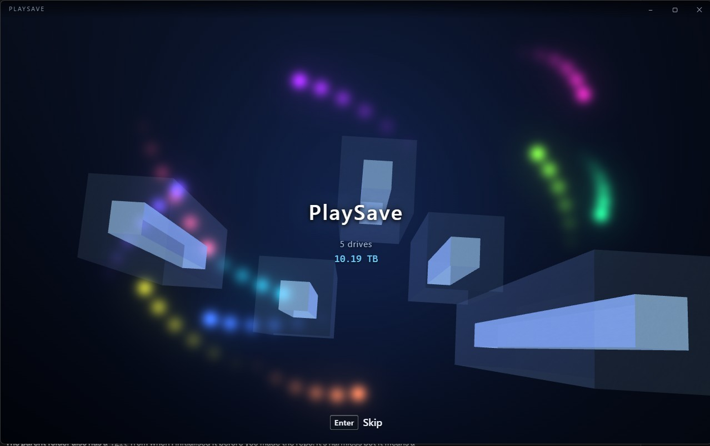
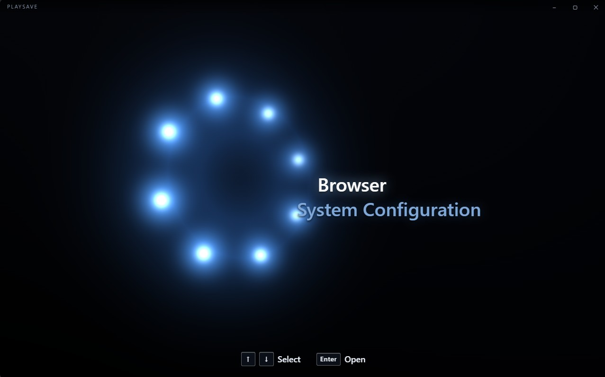
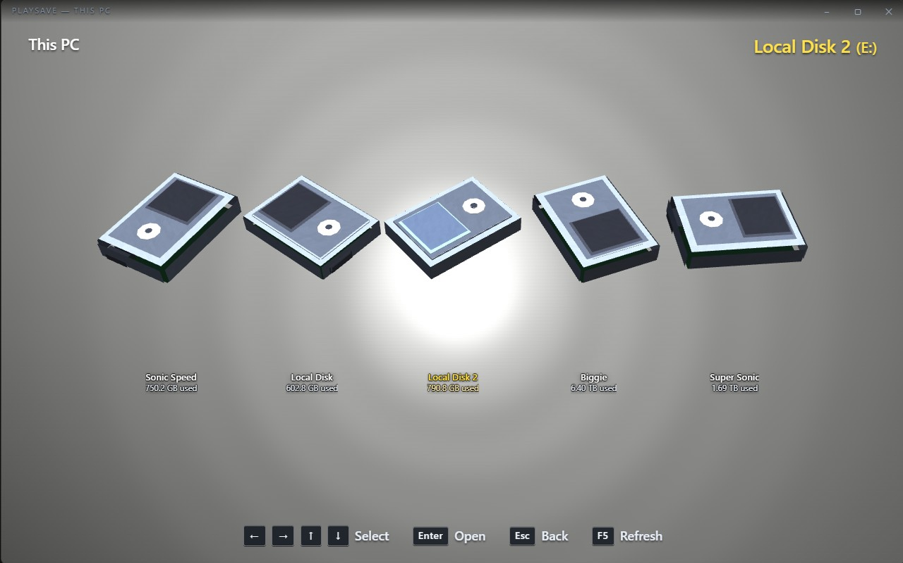
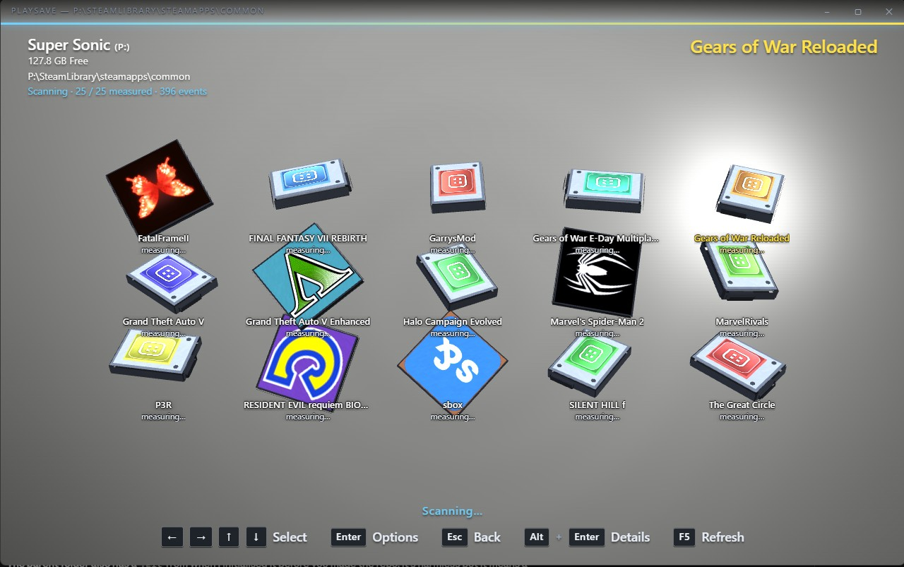

# PlaySave

A disk-usage analyser for Windows, dressed as a sixth-generation console's memory card browser.

Your drives are memory cards. Your folders are animated 3D save icons on a silver field, each
one carrying its real Windows shell icon — so a game's folder shows that game's actual logo.
Hover *Delete* and the icon flinches. Confirm, and it spins up and shrinks away to nothing.

It is a real tool underneath the costume: it scans, it measures, it copies, it deletes to the
Recycle Bin. It is just unwilling to be boring about it.

---

## Screenshots



*The opening: towers of light rising out of the void, one per drive, each as tall as that
drive is full. Coloured lights circle the scene while it reads.*



*The main menu. The ring of orbs turns in 3D — near ones swell and brighten, the far side
sinks into the black — over a faint wash of surf.*



*Every drive is a memory card. The one you are on catches the light.*



*Inside a Steam library. Each folder is a save icon wearing the game's own logo, pulled from
the shell icon already on your machine — and the grid fills in live while the scan is still
running rather than making you wait for it.*

---

## What it does

- **Scans your drives** recursively, with live progress — folders appear and fill in as they
  are measured rather than after.
- **Shows every folder and file as a 3D icon**, sized and coloured by what it is, wearing the
  shell icon Windows already has for it.
- **Animates them individually.** Two folders drawn as the same device still flinch, tilt and
  recover differently.
- **Copies** files and folders anywhere — pick a drive, then browse to the exact destination
  folder. Progress, cancellation, and a name clash resolved the way Explorer does it
  (`notes.txt` → `notes - Copy.txt`) rather than refused.
- **Deletes to the Recycle Bin.** Never a hard delete, and never a drive root or a system
  location — those are refused before anything happens.
- **Remembers your settings** between runs: sound, animations, label size, size units, icon
  source, and delete confirmation.

### The opening

The startup sequence flies over towers of light rising out of a dark void — one tower per
drive, its height set by how full that drive is. A machine with no drives gets an empty void.
You can skip it with Enter, or replay it from System Configuration.

### The sound

Everything you hear is synthesised from oscillators at runtime — the deep hit and chime of the
opening, the interface tones, and the slow surf under the main menu. No audio files ship with
the application.

---

## Installing

Download from the [Releases](../../releases) page:

- **`PlaySave_1.0.1_x64_en-US.msi`** — the installer. Double-click, and it lands in your Start
  menu like any other program.
- **`PlaySave-1.0.1-portable.exe`** — a single file, no installation. Put it wherever you like
  and run it.

Windows will warn you that the publisher is unknown, because the build is not code-signed —
a signing certificate costs money and this is a free project. Click **More info** →
**Run anyway** if you are happy to. The checksums on the release page let you verify you got
what was published.

Windows 11 has everything it needs. On Windows 10 the installer will fetch the WebView2
runtime if it is missing.

### Run it as Administrator

Reading the NTFS Master File Table requires opening the raw volume, which an ordinary token
cannot do. Without elevation the app walks every directory instead, which is much slower on a
large drive.

Elevation is never forced. If you start it unelevated, System Configuration offers
**Restart for fast scanning**, which raises the prompt once and relaunches. To make it
permanent: right-click the shortcut → Properties → Advanced → *Run as administrator*.

---

## Using it

It is keyboard-first, and every hint in the footer is also a button you can click.

| Key | Does |
| --- | --- |
| Arrow keys | Move between icons |
| Enter | Open a drive or folder, or open the options menu on a file |
| Esc | Back |
| Alt + Enter | Details for the selected item |
| F5 | Rescan the current folder |
| F1 | Full keyboard reference |

Settings live in `%APPDATA%\com.playsave.app\settings.json` — a plain file you can read or
delete.

---

## What it will not do

Worth stating plainly, since it is a program that deletes things.

- **Deletes go to the Recycle Bin only.** There is no hard-delete path in the code.
- **Drive roots are refused**, as are `Windows`, `Program Files`, `Program Files (x86)`,
  `ProgramData`, `System Volume Information`, `$Recycle.Bin`, and the root of a user profile.
- **Copies never overwrite.** If the name is taken, the copy is renamed; nothing is replaced.
- **A failed or cancelled copy cleans up after itself** — the partial goes to the Recycle Bin
  rather than being left looking finished.
- **Nothing is sent anywhere.** There is no network code in the application at all.

---

## Known limitations

- **The MFT fast path usually falls back to a directory walk.** System Configuration will
  often report `MFT available · elevated` and still walk, so a full scan of a large drive
  takes minutes rather than seconds. The scan is correct, just slow. This is the main thing
  left to fix.
- **Copy between drives has no resume.** Cancel is clean, but there is no picking up where it
  left off.
- **Windows only.** The rendering and interface are portable; the scanner, shell icons and
  Recycle Bin integration are not.

---

## Building from source

```bash
npm install
npm run dev      # launches the real app in a native window
npm run build    # produces the .exe plus installers
```

The first Rust compile takes a few minutes; after that it is seconds.

**Requirements:** Rust 1.77+ (MSVC toolchain), Node 20+, Visual Studio Build Tools 2022, and
the WebView2 runtime (already present on Windows 11).

### Building something you intend to hand to other people

Rust bakes the absolute path of every source file it compiles into the binary, for panic
messages. On an ordinary machine that means your home directory — often your real name — ends
up as readable text inside a program strangers download. `strip = true` does **not** remove it:
those are ordinary string constants, not debug information.

So set this before building a release, in PowerShell:

```powershell
$env:RUSTFLAGS = "--remap-path-prefix=$env:USERPROFILE\.cargo=cargo"
npm run build
```

Then check it worked before publishing anything — searching the built `.exe` for your own
username should come back empty.

### Other commands

```bash
npm run check              # geometry and animation checks
cargo test --release       # backend tests, from src-tauri/
node tools/make-icon.js    # regenerate the application icons
```

`npm run check` audits the meshes for coplanar faces that would z-fight, validates the
animation archetypes, and verifies that nothing in the boot scene occupies the same space as
anything else. It is worth running after touching anything under `src/gl/`.

---

## Licence

[GNU General Public License v3.0 or later](LICENSE).

You may use, study, modify and redistribute this program. If you distribute a modified
version, it must also be free software under the same licence, with source available.

---

## Disclaimer

PlaySave is an independent homage. It is **not affiliated with, endorsed by, or sponsored by
Sony Interactive Entertainment Inc.** "PlayStation" is a trademark of Sony Interactive
Entertainment Inc., used here only to describe what inspired this project.

No assets from any console are included in this repository or in the built application:

- All audio is synthesised from oscillators at runtime. No recordings ship with it.
- No console system font is used or included.
- The icon artwork you see on the save icons comes from the shell icons already present on
  your own machine, read at runtime. Nothing is extracted, bundled or redistributed.
